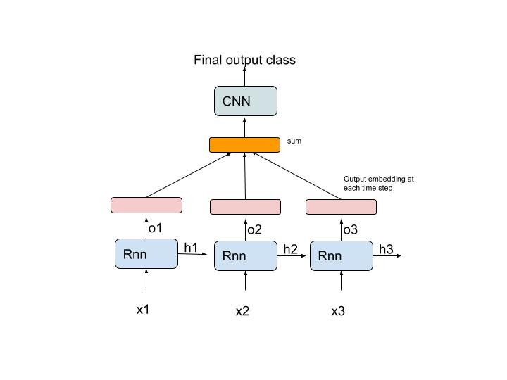

# Comments-Classifiaction-using-RNN-and-CNN
In this project I use pytorch's nn.module package to build a RNN+CNN model to classify youtube comments as spam or not spam. We use the [Youtube Spam Collection Dataset](https://archive.ics.uci.edu/ml/datasets/YouTube+Spam+Collection#) from UCI.

**Model Architecture**

**Results**

The best model achieved in terms of validation accuracy achieves **90.22 training accuracy and 88.78 validation accuracy.**

Training and Validation

Training starts!

---------------------------------------------------------------------------------------------------

| Epoch   1 | train loss  0.68 | train acc 58.44 | val loss  0.67 | val acc 57.14 | time:  2.68s |

| Epoch   2 | train loss  0.65 | train acc 63.75 | val loss  0.65 | val acc 57.65 | time:  2.23s |

| Epoch   3 | train loss  0.62 | train acc 71.42 | val loss  0.63 | val acc 61.99 | time:  2.30s |

| Epoch   4 | train loss  0.56 | train acc 81.52 | val loss  0.52 | val acc 86.22 | time:  2.35s |

| Epoch   5 | train loss  0.48 | train acc 85.55 | val loss  0.46 | val acc 87.24 | time:  2.34s |

| Epoch   6 | train loss  0.45 | train acc 86.57 | val loss  0.46 | val acc 85.71 | time:  2.33s |

| Epoch   7 | train loss  0.44 | train acc 86.76 | val loss  0.47 | val acc 84.95 | time:  2.33s |

| Epoch   8 | train loss  0.43 | train acc 87.92 | val loss  0.44 | val acc 86.99 | time:  2.37s |

| Epoch   9 | train loss  0.44 | train acc 87.15 | val loss  0.45 | val acc 86.22 | time:  2.28s |

| Epoch  10 | train loss  0.44 | train acc 87.60 | val loss  0.43 | val acc 88.27 | time:  2.35s |

| Epoch  11 | train loss  0.44 | train acc 86.89 | val loss  0.44 | val acc 86.99 | time:  2.26s |

| Epoch  12 | train loss  0.43 | train acc 88.24 | val loss  0.43 | val acc 87.50 | time:  2.29s |

| Epoch  13 | train loss  0.43 | train acc 87.66 | val loss  0.44 | val acc 86.73 | time:  2.27s |

| Epoch  14 | train loss  0.43 | train acc 88.24 | val loss  0.43 | val acc 88.52 | time:  2.25s |

| Epoch  15 | train loss  0.42 | train acc 88.68 | val loss  0.44 | val acc 86.73 | time:  2.26s |

| Epoch  16 | train loss  0.42 | train acc 89.00 | val loss  0.43 | val acc 87.50 | time:  2.30s |

| Epoch  17 | train loss  0.42 | train acc 89.07 | val loss  0.44 | val acc 87.24 | time:  2.33s |

| Epoch  18 | train loss  0.42 | train acc 88.68 | val loss  0.43 | val acc 88.01 | time:  2.25s |

| Epoch  19 | train loss  0.42 | train acc 89.32 | val loss  0.43 | val acc 88.27 | time:  2.23s |

| Epoch  20 | train loss  0.42 | train acc 88.75 | val loss  0.44 | val acc 87.76 | time:  2.24s |

| Epoch  21 | train loss  0.42 | train acc 88.94 | val loss  0.43 | val acc 88.27 | time:  2.32s |

| Epoch  22 | train loss  0.42 | train acc 89.51 | val loss  0.43 | val acc 87.50 | time:  2.26s |

| Epoch  23 | train loss  0.41 | train acc 89.45 | val loss  0.43 | val acc 87.24 | time:  2.36s |

| Epoch  24 | train loss  0.41 | train acc 90.28 | val loss  0.43 | val acc 87.76 | time:  2.25s |

| Epoch  25 | train loss  0.41 | train acc 89.90 | val loss  0.43 | val acc 87.76 | time:  2.31s |

| Epoch  26 | train loss  0.41 | train acc 89.96 | val loss  0.43 | val acc 89.03 | time:  2.36s |

| Epoch  27 | train loss  0.41 | train acc 90.28 | val loss  0.42 | val acc 88.27 | time:  2.31s |

| Epoch  28 | train loss  0.43 | train acc 88.30 | val loss  0.43 | val acc 87.76 | time:  2.33s |

| Epoch  29 | train loss  0.42 | train acc 89.51 | val loss  0.43 | val acc 88.01 | time:  2.21s |

| Epoch  30 | train loss  0.41 | train acc 89.77 | val loss  0.43 | val acc 88.27 | time:  2.32s |

| Epoch  31 | train loss  0.41 | train acc 89.64 | val loss  0.43 | val acc 88.52 | time:  2.30s |

| Epoch  32 | train loss  0.41 | train acc 90.86 | val loss  0.43 | val acc 88.01 | time:  2.28s |

| Epoch  33 | train loss  0.41 | train acc 89.58 | val loss  0.43 | val acc 87.50 | time:  2.30s |

| Epoch  34 | train loss  0.41 | train acc 89.39 | val loss  0.43 | val acc 88.27 | time:  2.26s |

| Epoch  35 | train loss  0.40 | train acc 90.73 | val loss  0.43 | val acc 88.27 | time:  2.27s |

| Epoch  36 | train loss  0.41 | train acc 90.22 | val loss  0.42 | val acc 88.78 | time:  2.37s |

| Epoch  37 | train loss  0.41 | train acc 90.54 | val loss  0.43 | val acc 88.27 | time:  2.37s |

| Epoch  38 | train loss  0.41 | train acc 90.47 | val loss  0.44 | val acc 87.50 | time:  2.30s |

| Epoch  39 | train loss  0.41 | train acc 89.83 | val loss  0.43 | val acc 88.52 | time:  2.35s |

| Epoch  40 | train loss  0.42 | train acc 89.51 | val loss  0.44 | val acc 86.48 | time:  2.33s |

---------------------------------------------------------------------------------------------------

Training finished!
Please find the saved model and training log in results_dir
 
 Note : we run 40 epochs and save the model with best Validation accuracy. While running epochs we do a ReduceLROnPlateau Scheduling with a patience of 5 with an initial learning rate = 1e-4.  

